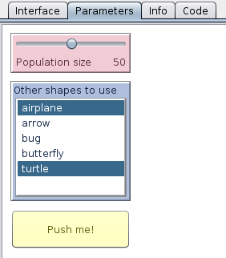

An extension for creating additional interface tabs in the [NetLogo](https://github.com/NetLogo/NetLogo) GUI and putting custom widgets on them.

### Installing

To install the eXtraWidgets extension, assuming that you already have [NetLogo](https://ccl.northwestern.edu/netlogo/download.shtml) installed, [**download** the extension](https://github.com/nicolaspayette/eXtraWidgets/releases/latest) and unzip it NetLogo's `extensions/` folder, like you would for any other [NetLogo extension](http://ccl.northwestern.edu/netlogo/docs/extensions.html).

The extension was developed and tested with NetLogo 5.1.0. There is a good chance that it will work with other versions of NetLogo >= 5.0, but we have not checked.

### Using

Unlike regular NetLogo widgets, the extra widgets and tabs are created through code. While this may sound daunting at first, it has some advantages:

- You can [create dynamic interfaces](https://github.com/nicolaspayette/eXtraWidgets/wiki/Creating-dynamic-interfaces) that change with the circomstances (a bit like with the [Goo extension](https://github.com/NetLogo/Goo-Extension/), but more powerful.)
- The extra widgets provided here are a bit more flexible than the regular NetLogo widgets: you have control over colors and font sizes, the widgets can hidden or disabled, their labels are independant from their names, etc.
- It can provides widget kinds that are unavailable in regular NetLogo. The only one of those at the moment is the [multi-chooser widget](https://github.com/nicolaspayette/eXtraWidgets/wiki/Bundled-Widget-Kinds#multichooser), but [more could be added](https://github.com/nicolaspayette/eXtraWidgets/wiki/Developing-Extra-Widget-Kinds).
- Writing code allows precise positioning: no fiddling with the mouse to get your widgets aligned.

And besides, it's really not that hard: the extension works in such a way that [manipulating widgets is just like manipulating turtles](https://github.com/nicolaspayette/eXtraWidgets/wiki/Widget-contexts)!

To learn more about how to use the extension, take a look at the [wiki](https://github.com/nicolaspayette/eXtraWidgets/wiki), especially the [Primitives](https://github.com/nicolaspayette/eXtraWidgets/wiki/Primitives) and [Bundled Widget Kinds](https://github.com/nicolaspayette/eXtraWidgets/wiki/Bundled-Widget-Kinds) pages.

If you encounter any difficulties, [ask a question on StackOverflow](http://stackoverflow.com/questions/tagged/netlogo). If you believe you have found a bug (or would like to request a feature) [open a new issue](https://github.com/nicolaspayette/eXtraWidgets/issues/new).

What follows is an example demonstrating some of the things that you can do with the extension. (Note that a [good place to put your interface code](https://github.com/nicolaspayette/eXtraWidgets/wiki/Creating-your-interface-at-startup) is in the  [`startup`](http://ccl.northwestern.edu/netlogo/docs/dictionary.html#startup) procedure, which runs automatically when your model is opened.)


```
extensions [xw]

to startup
  xw:clear-all ; remove all previous extra tabs and widgets, if any
  ; create a new tab to the right of the regular interface tab
  ; (tabs and widgets need a "key": a string that identifies them)
  xw:create-tab "t1" [ ; we use "t1" as the key for our new tab
    ; and set its parameters within a command block:
    xw:set-title "Parameters"
  ]
  ; create a slider on the new tab, similar to a regular slider
  ; the slider is placed in the upper left corner by default
  xw:create-slider "population" [
    xw:set-label "Population size"
  ]
  ; a "multi-chooser", unlike a regular chooser, lets you select multiple items:
  xw:create-multi-chooser "shapes" [
    xw:set-label "Other shapes to use"
    xw:set-items ["airplane" "arrow" "bug" "butterfly" "turtle"]
    xw:set-selected-items n-of 2 xw:items ; two random shapes by default
    ; set y relative to the bottom of the "population" slider:
    xw:set-y [ xw:y + xw:height + 10 ] xw:of "population"
    xw:set-height 150
  ]
  ; you can also put buttons on the extra tabs:
  xw:create-button "setup" [
    xw:set-label "Push me!"
    xw:set-commands "setup" ; commands, given as strings, are compiled on execution
    xw:set-y [ xw:y + xw:height + 10 ] xw:of "shapes"
  ]
  ; xw:ask let's you do stuff with multiple widgets at a time
  ; (see also xw:of and xw:with)
  xw:ask xw:widgets [
    let c one-of base-colors
    xw:set-color c + 3      ; widgets can be any color!
    xw:set-text-color c - 3 ; and you can change their text color as well
  ]
end
```

Here is a possible outcome of this procedure on Linux (it would look slightly different on Mac or Windows):



Now let's use the values from those widgets in your `setup` procedure. As opposed to regular NetLogo widgets, extra widgets don't create global variables. You need to use `xw:get` and `xw:set` to get and set their values. Here is how you could do it in this case:

```
to setup
  clear-all
  create-turtles xw:get "population" [
    set shape one-of fput "default" xw:get "shapes"
    fd 10
    xw:select-tab 1 ; select the regular interface tab
  ]
end
```

### Extending

We believe that eXtraWidgets is the first "extensible extension" for NetLogo. New widgets kinds can be added to the extension just by dropping a JAR in a folder under `xw/widgets`. [Developer documentation](https://github.com/nicolaspayette/eXtraWidgets/wiki/Developing-Extra-Widget-Kinds) is scarce at the moment, so your best bet is probably to [take a look at the source code of existing widgets](https://github.com/nicolaspayette/eXtraWidgets/tree/master/xw/widgets). The [ScalaDoc for the API](https://nicolaspayette.github.io/eXtraWidgets/) is also a good ressource.

Just like users, developers encountering any difficulties can either [open a new issue](https://github.com/nicolaspayette/eXtraWidgets/issues/new) or [ask a question on StackOverflow](http://stackoverflow.com/questions/tagged/netlogo).

### Licensing

The extension was developed by [Nicolas Payette](https://github.com/nicolaspayette) at the [Centre for Research in Social Simulation (CRESS)](http://cress.soc.surrey.ac.uk/), under the supervision of [Nigel Gilbert](http://cress.soc.surrey.ac.uk/web/people/director-cress) and [Jen Badham](http://cress.soc.surrey.ac.uk/web/people/researchers/76-jen-Badham). Its first use case was for a model that is part of the [TELL ME project](http://www.tellmeproject.eu/).

The extension is distributed under the [MIT License](LICENSE.txt).

[NetLogo](http://ccl.northwestern.edu) itself is authored by [Uri Wilensky](http://ccl.northwestern.edu/uri/) and [distributed under the GPL](http://ccl.northwestern.edu/netlogo/docs/copyright.html).

---
[](https://magnum.travis-ci.com/nicolaspayette/eXtraWidgets)
