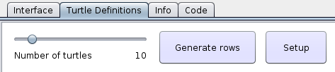
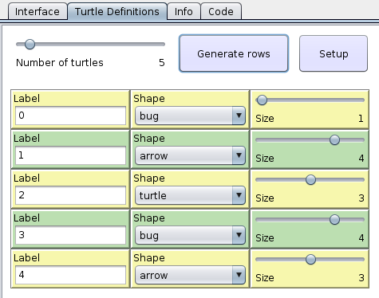
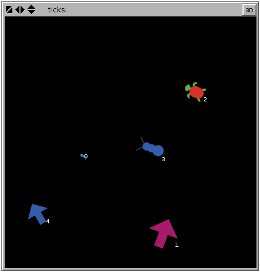

One advantage of the eXtraWidgets extension over the regular NetLogo interface is that it is possible to generate your interface in different ways, depending on the circumstances.

Generating a varying number of rows of widgets, that act together as a sort of table for entering data, is an example of that. In order to do that, you can start by creating widgets for entering the parameters that will be used to generate the rest of the interface:

```nlogo
extensions [xw]

to startup
  xw:clear-all
  xw:create-tab "t1" [
    xw:set-title "Turtle Definitions"
  ]
  xw:create-slider "nb-rows" [
    xw:set-label "Number of turtles"
    xw:set-opaque? false
    xw:set-value 10
    xw:set-width 200
  ]
  xw:create-button "generate" [
    xw:set-label "Generate rows"
    xw:set-x [ xw:x + xw:width + 10 ] xw:of "nb-rows"
    xw:set-commands "generate-rows"
    xw:set-width 140
  ]
  xw:create-button "setup" [
    xw:set-label "Setup"
    xw:set-x [ xw:x + xw:width + 10 ] xw:of "generate"
    xw:set-commands "setup"
    xw:set-width 90
  ]
  xw:select-tab 2 ; go to the extra tab on startup
end
```

Note that we are [creating the interface at startup](Creating your interface at startup.md).

Here is the result on Linux:



You first set the number of turtles you want via the slider. The **Generate rows** button can then call the `generate-rows` procedure, which generates one row of widgets for each turtle that we want to define. Here it is:

```nlogo
to generate-rows
  foreach xw:widgets xw:with [
    not member? xw:key ["nb-rows" "generate" "setup"]
  ] xw:remove
  foreach n-values xw:get "nb-rows" [ [i] -> i ] [ [i] ->
    let y (i * 50) + [ xw:y + xw:height + 20 ] xw:of "nb-rows"
    let label-key word "label-" i
    xw:create-text-input label-key [
      xw:set-label "Label"
      xw:set-text (word i)
      xw:set-y y
    ]
    let shape-key word "shape-" i
    xw:create-chooser shape-key [
      xw:set-label "Shape"
      xw:set-items ["airplane" "arrow" "bug" "butterfly" "turtle"]
      xw:set-selected-item one-of xw:items
      xw:set-x [ xw:x + xw:width ] xw:of label-key
      xw:set-y y
    ]
    let size-key word "size-" i
    xw:create-slider size-key [
      xw:set-label "Size"
      xw:set-minimum 1
      xw:set-maximum 5
      xw:set-value 1 + random 5 
      xw:set-x [ xw:x + xw:width ] xw:of shape-key
      xw:set-y y
    ]
    xw:ask (list label-key size-key shape-key) [
      ; alternate between yellow and green rows
      xw:set-color (yellow + 3) + (10 * (i mod 2))
    ]
  ]
end
```
Here is the resulting table for 5 rows:



Finally, the **Setup** button calls the `setup` procedure, which uses the values entered in our "table" to actually create the turtles:
```nlogo
to setup
  clear-all
  let n length xw:text-inputs
  foreach n-values n [ [i] -> i ] [ [i] ->
    create-turtles 1 [
      set label xw:get word "label-" i
      set shape xw:get word "shape-" i
      set size xw:get word "size-" i
      setxy random-xcor random-ycor
    ]
  ]
  xw:select-tab 1 ; go back to regular interface
end
```

Note the `xw:select-tab 1` command, which takes us back to the regular interface tab, where the view is, so we can see the result of what we just did, which can be something like:


