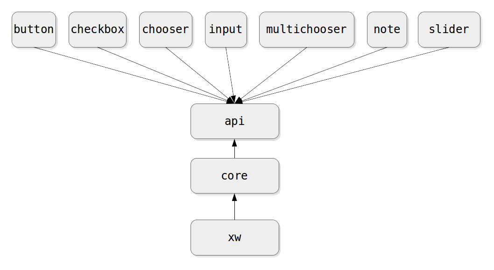

This is the documentation for developers wanting to extend the extension. Users wanting to learn about the extension should [start here instead](README.md#getting-started).

## Architecture

The eXtraWidget architecture is fairly modular. Complete understanding of it is not strictly required for developing new kinds of widgets, but it can't hurt to have an overview.

Here is the dependency diagram:



It is basically a summary of the information contained in the main [`build.sbt`](../build.sbt). Each module is a separate sbt sub-project and compiles to its own JAR.

All new widget kinds should only depend on the `api` JAR.

Ideally, `api` would have contained only interfaces, but as it stands, it contains implementations as well. Future work on the project should try to move most implementations to `core`.

The point of having separate modules for `core` and `xw` (the latter being the extension itself) is that, in theory, the extension is only one of the possible ways to manipulate extra widgets. We could envision a plugin that would manipulate all widgets through the GUI. This plugin would depend on `core` and could co-exist with the extension while remaining independent from it.

The state of the extension (i.e., widgets and the values of their properties) is stored in a map of maps: `Map[WidgetKey, Map[PropertyKey, PropertyValue]]`. In other words, a map from widget keys to maps from property keys to property values. These maps are Java [`ConcurrentSkipListMap`](https://docs.oracle.com/javase/8/docs/api/java/util/concurrent/ConcurrentSkipListMap.html), which allows for concurrent access and keeps the keys in alphabetical order. Keys are strings and property values are `AnyRef` (the Scala equivalent of `java.lang.Object`). The concurrent access part is important because the map can be modified from both NetLogo's job thread (when extension [primitives](Primitives.md) are used) and the AWT Event thread (when a user manipulates widgets on the screen). You should probably read [the note on threads in the NetLogo architecture guide](https://github.com/NetLogo/NetLogo/wiki/Architecture#threads) to get a better idea of what this implies.

## A note about versions

Since the extension is built to work with NetLogo 6.x, [you need to use Scala 2.12.x and Java 8](https://github.com/NetLogo/NetLogo/wiki/Building#tools).

## Widget Kinds

As you can see from [the source code of various widget kinds bundled with the extension](../xw/widgets), you need to define at least two classes to create a new widget kind:

- A class that extends [`uk.ac.surrey.xw.api.WidgetKind`](../api/src/main/scala/uk/ac/surrey/xw/api/WidgetKind.scala). This is the definition of your widget that will be loaded at runtime by the extension to find out what properties are available for your kind and what to name the primitives that it will generate.

- A class that extends [`uk.ac.surrey.xw.api.ExtraWidget`](../api/src/main/scala/uk/ac/surrey/xw/api/ExtraWidget.scala). This is the class of your widgets themselves, those that will appear on the screen.

We'll say a few words about each of those in turn. This, along with [Properties](#properties), should be enough to get you started.

### The `WidgetKind` Class

You should refer to [the ScalaDoc](https://cress-surrey.github.io/eXtraWidgets/#uk.ac.surrey.xw.api.WidgetKind) for details, but when extending `WidgetKind`, there are two things that you absolutely need to provide:

- A name for your class (`name`) that the extension will use to generate primitives.
- A constructor function (`newWidget`) that the extension will use to create widget instances.

In addition, you will most likely want to provide:

- A few extra [properties](#properties) (`WidgetKind` gives you the `KIND` and `KEY` properties, but your widget would not be very useful if that is all you had). Be sure to override `propertySet` to include your custom properties, probably by appending your own set to `super.propertySet`.
- A default property (`defaultProperty`) to be used with the `xw:get` and `xw:set` primitives.

In some instances, you may want to also provide:

- A plural name for your kind (`pluralName`). The extension usually just adds an `'S'`, but sometimes, that's not enough (e.g., `"CHECKBOX"` → `"CHECKBOXES"`).
- Default values for your properties (`defaultValues`).

Also note that `WidgetKind` has a type parameter that indicates the type of the widget instances. When extending `WidgetKind`, you will typically do something like this:

```scala
class MyWidgetKind[W <: MyWidget] extends WidgetKind[W]
```

Well, that's not quite true. The api does provide [`JComponentWidgetKind`](https://cress-surrey.github.io/eXtraWidgets/#uk.ac.surrey.xw.api.JComponentWidgetKind), a class that extends `WidgetKind` with most of the properties you need for a [`JComponent`](https://docs.oracle.com/javase/8/docs/api/javax/swing/JComponent.html) widget. I see no reason why you wouldn't want to do that. So:

```scala
class MyWidgetKind[W <: MyWidget] extends JComponentWidgetKind[W]
```

Note that, in such a case, `MyWidget` would need to extend `JComponentWidget` (which, again, is something that you probably want. The extension also provide a couple of more specialized kinds, of which [`LabeledPanelWidgetKind`](https://cress-surrey.github.io/eXtraWidgets/#uk.ac.surrey.xw.api.LabeledPanelWidgetKind) (the "super kind" of choosers, multi-choosers, sliders and inputs) is more likely to be useful.

To conclude with an example, here is (as of December 2014), the full `SliderKind` class (a lot of stuff being provided by `LabeledPanelWidgetKind`, of course):

```scala
class SliderKind[W <: Slider] extends LabeledPanelWidgetKind[W] {
  override val name = "SLIDER"
  override val newWidget = new Slider(_, _, _)
  val valueProperty = new DoubleProperty[W](
    "VALUE", Some(_.sliderData.setValue(_)), _.sliderData.value, 50)
  override val defaultProperty = Some(valueProperty)
  override val propertySet = super.propertySet ++ Set(valueProperty,
    new StringProperty[W]("UNITS",
      Some(_.setUnits(_)), _.units),
    new DoubleProperty[W]("MINIMUM",
      Some(_.sliderData.setMinimum(_)), _.sliderData.minimum, 0d),
    new DoubleProperty[W]("MAXIMUM",
      Some(_.sliderData.setMaximum(_)), _.sliderData.maximum, 100d),
    new DoubleProperty[W]("INCREMENT",
      Some(_.sliderData.setIncrement(_)), _.sliderData.increment, 1d)
  )
}
```

### The `ExtraWidget` Class

This is the code for your actual widget.

One requirement is that your constructor should take parameters [`key: WidgetKey`](https://cress-surrey.github.io/eXtraWidgets/#uk.ac.surrey.xw.api.package), [`state: State`](https://cress-surrey.github.io/eXtraWidgets/#uk.ac.surrey.xw.api.State), and [`ws: GUIWorkspace`](https://github.com/NetLogo/NetLogo/blob/hexy/netlogo-gui/src/main/window/GUIWorkspace.java), and that those are declared as **`val`** so that they implement abstract values of the same name in `ExtraWidget`.

The other requirement is that you provide a `kind` value for instances of your class. The code for `Slider` illustrates these requirements:

```scala
class Slider(
  val key: WidgetKey,
  val state: State,
  val ws: GUIWorkspace)
  extends LabeledPanelWidget {

  override val kind = new SliderKind[this.type]

  // ... lots of other stuff ...

}
```

(Note: perhaps there would be a way to organize the types such that it would not be necessary to provide the widget's singleton type (`this.type`) to the kind class, but I haven't found it yet.)

Notice how the class extends `LabeledPanelWidget` (which in turn extends `JComponentWidget` and so on until we reach `ExtraWidget` as the root class).

The actual content of the class will vary a lot from one widget to another.

- A bunch of getters and setters to be used by [properties](#properties).
- A [swing event listener](http://docs.oracle.com/javase/tutorial/uiswing/events/) that will update the state of the extension using the `ExtraWidget.updateInState` method.

The goal of `updateInState` is to update the value of a property in the extension's `State` following user interactions. In a slider, for example, this is what happens when a user drags the slider's knob around:

```scala
slider.onStateChange { _ =>
  sliderData.updateFromTicks(slider.getValue)
  valueLabel.update()
  updateInState(kind.valueProperty)
}
```

The `onStateChange` method (defined in the [`uk.ac.surrey.xw.api.swing`](../api/src/main/scala/uk/ac/surrey/xw/api/swing/package.scala) package) is just a shortcut to add a [`javax.swing.event.ChangeListener`](https://docs.oracle.com/javase/8/docs/api/javax/swing/event/ChangeListener.html) to our slider. `sliderData.updateFromTicks(slider.getValue)` and `valueLabel.update()` update some fields of the widget class following the change of value.

The interesting line is `updateInState(kind.valueProperty)`: it tells the extension to update the `valueProperty` of the slider (as defined in `SliderKind`) in its state map. And properties happen to be the topic of our next section.

## Properties

Unless you need `Float`s or `Long`s (for which I haven't defined property classes) you shouldn't have to write property classes: you just need to understand how to create instances of the provided classes. Those are:

- `ObjectProperty`
- `StringProperty`
- `BooleanProperty`
- `IntegerProperty`
- `DoubleProperty`
- `ColorProperty`
- `ListProperty`

As might you might have guessed, each of them allows you to define a property of a particular type. When creating an instance, you will need to provide:

- The type of the widget that this property applies to. This is normally the type parameter of the widget kind itself. For example, if your kind is defined as `SliderKind[W <: Slider]`, you just pass on `W` to your property definitions, e.g.: `new StringProperty[W](/*...*/)`.
- The property key, as an uppercase string.
- A setter function of type `Option[(W, T) ⇒ Unit]`, where `W` is the widget's type and `T` is the property's type. Often, this will just forward a call the a method of the widget. For example, the setter of the `"UNITS"` property in a slider is: `Some(_.setUnits(_))`. If the property should be read-only, simply pass `None` instead.
- A getter function of type `W ⇒ T`. Again, this is most likely just a call to a getter method in the widget, e.g.: `_.units`.
- A default value for the property. That last parameter can be omitted, in which case the default will be: `nobody` for an `ObjectProperty`, `""` for a `StringProperty`, `false` for a `BooleanProperty`, `0` for an `IntegerProperty`, `0.0` for a `DoubleProperty`, `white` for a `ColorProperty` and `[]` for a `ListProperty`.

And that's it. Don't forget to make sure that your properties are included in the `propertySet` of your `WidgetKind`.

## A note about Java

I think it should be possible to create new widget kinds using Java (or any other JVM language, for that matter), but I haven't tried. That being said, interacting with NetLogo in general is much easier from Scala then from Java. And there is a better chance that I will be able to help you with your project if you use Scala.

## Getting help

In addition to the usual options of [opening a new issue](https://github.com/CRESS-Surrey/eXtraWidgets/issues/new) or [asking a question on StackOverflow](http://stackoverflow.com/questions/tagged/netlogo), you're welcome to [send me an email](mailto:nicolaspayette@gmail.com) if you're thinking about developing a new widget kind. I am well aware that the instructions provided here are a little thin, and I'd be happy to fill in the gaps as needed.
