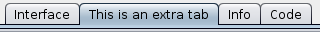

Those are the widget kinds that are bundled with the extension:

[Tab](#tab),
[Button](#button),
[Checkbox](#checkbox),
[Chooser](#chooser),
[Multi-Chooser](#multi-chooser),
[Note](#note),
[Numeric Input](#numeric-input),
[Slider](#slider),
[Text-Input](#text-input).

(Other kinds [could also be added](Developing-extra-widget-kinds.md).)

---
## Tab

A tab is a container for the widgets provided by the extension. Each you [create a new widget](#xwcreate-kind), it is placed on the most recently created tab. Or can explicitly set the widget's [tab property](Properties.md#tab) with [`xw:set-tab`](#xwset-property).

A tab is not a widget _per se_ (and not included in the list reported by [`xw:widgets`](Primitives.md#xwwidgets)), but it is mostly manipulated in the same way.

Extra tabs created by the extension are inserted between NetLogo's main Interface tab and the Info tab. You can change the order of the extra tabs relative to one another by setting their [order property](Properties.md#order).

[Create](Primitives.md#xwcreate-kind) | [List](Primitives.md#xwkinds) | Default Property
--- | --- | ---
`xw:create-tab` | `xw:tabs` | None

Property | [Getter](Primitives.md#xwproperty) | [Setter](Primitives.md#xwset-property) | Type | Default
--- | --- | --- | --- | --- | ---
[Color](Properties.md#color) | `xw:color` | `xw:set-color` | [Color](Colors) | `white`
[Enabled?](Properties.md#enabled) | `xw:enabled?` | `xw:set-enabled?` | Boolean | `true`
[Key](Properties.md#key) | `xw:key` | None | String | n/a
[Kind](Properties.md#kind) | `xw:kind` | None | String | `"TAB"`
[Order](Properties.md#order) | `xw:order` | `xw:set-order` | Number | `0`
[Title](Properties.md#title) | `xw:title` | `xw:set-title` | String | `""`

---
## Button

A button runs the string contained in its [Commands](Properties.md#commands) property when clicked.

[Create](Primitives.md#xwcreate-kind) | [List](Primitives.md#xwkinds) | Default Property
--- | --- | ---
`xw:create-button` | `xw:buttons` | None

Property | [Getter](Primitives.md#xwproperty) | [Setter](Primitives.md#xwset-property) | Type | Default
--- | --- | --- | --- | ---
[Color](Properties.md#color) | `xw:color` | `xw:set-color` | [Color](Colors) | `[188 188 230 255]`
[Commands](Properties.md#commands) | `xw:commands` | `xw:commands` | String | `""`
[Enabled?](Properties.md#enabled) | `xw:enabled?` | `xw:set-enabled?` | Boolean | `true`
[Font color](Properties.md#font-color) | `xw:font-color` | `xw:set-font-color` | [Color](Colors) | `black`
[Font size](Properties.md#font-size) | `xw:font-size` | `xw:set-font-size` | Number | `12`
[Height](Properties.md#height) | `xw:height` | `xw:set-height` | Number | `25`
[Hidden?](Properties.md#hidden) | `xw:hidden?` | `xw:hidden?` | Boolean | `false`
[Key](Properties.md#key) | `xw:key` | None | String | n/a
[Kind](Properties.md#kind) | `xw:kind` | None | String | `"BUTTON"`
[Label](Properties.md#label) | `xw:label` | `xw:set-label` | String | `""`
[Tab](Properties.md#tab) | `xw:tab` | `xw:set-tab` | String | Last created tab
[Width](Properties.md#width) | `xw:width` | `xw:set-width` | Number | `150`
[X](Properties.md#x) | `xw:x` | `xw:set-x` | Number | `10`
[Y](Properties.md#y) | `xw:y` | `xw:set-y` | Number | `10`

---
## Checkbox

A checkbox allows the user to choose if something should be `true` or `false`. It serves the same function as a regular NetLogo switch widget.

The [Selected?](Properties.md#selected) property contains the current choice.

[Create](Primitives.md#xwcreate-kind) | [List](Primitives.md#xwkinds) | Default Property
--- | --- | ---
`xw:create-checkbox` | `xw:checkboxes` | [Selected?](Properties.md#selected)

Property | [Getter](Primitives.md#xwproperty) | [Setter](Primitives.md#xwset-property) | Type | Default
--- | --- | --- | --- | ---
[Color](Properties.md#color) | `xw:color` | `xw:set-color` | [Color](Colors) | `[130 188 183 255]`
[Enabled?](Properties.md#enabled) | `xw:enabled?` | `xw:set-enabled?` | Boolean | `true`
[Font color](Properties.md#font-color) | `xw:font-color` | `xw:set-font-color` | [Color](Colors) | `black`
[Font size](Properties.md#font-size) | `xw:font-size` | `xw:set-font-size` | Number | `12`
[Height](Properties.md#height) | `xw:height` | `xw:set-height` | Number | `25`
[Hidden?](Properties.md#hidden) | `xw:hidden?` | `xw:hidden?` | Boolean | `false`
[Key](Properties.md#key) | `xw:key` | None | String | n/a
[Kind](Properties.md#kind) | `xw:kind` | None | String | `"CHECKBOX"`
[Label](Properties.md#label) | `xw:label` | `xw:set-label` | String | `""`
[Opaque?](Properties.md#opaque) | `xw:opaque?` | `xw:set-opaque?` | Boolean | `true`
**[Selected?](Properties.md#selected)** | `xw:selected?` | `xw:set-selected?` | Boolean | `false`
[Tab](Properties.md#tab) | `xw:tab` | `xw:set-tab` | String | Last created tab
[Width](Properties.md#width) | `xw:width` | `xw:set-width` | Number | `150`
[X](Properties.md#x) | `xw:x` | `xw:set-x` | Number | `10`
[Y](Properties.md#y) | `xw:y` | `xw:set-y` | Number | `10`

---
## Chooser

A chooser allows the user to choose one value out of a list.

The available values are defined through the [Items](Properties.md#items) property. They are provided as a list and can be of any valid NetLogo type. (Caveat: some types don't work with [`xw:export`](Primitives.md#xwexport).)

The [Selected Item](Properties.md#selected-item) property contains the current choice.

[Create](Primitives.md#xwcreate-kind) | [List](Primitives.md#xwkinds) | Default Property
--- | --- | ---
`xw:create-chooser` | `xw:choosers` | [Selected Item](Properties.md#selected-item)

Property | [Getter](Primitives.md#xwproperty) | [Setter](Primitives.md#xwset-property) | Type | Default
--- | --- | --- | --- | ---
[Color](Properties.md#color) | `xw:color` | `xw:set-color` | [Color](Colors) | `[130 188 183 255]`
[Enabled?](Properties.md#enabled) | `xw:enabled?` | `xw:set-enabled?` | Boolean | `true`
[Font color](Properties.md#font-color) | `xw:font-color` | `xw:set-font-color` | [Color](Colors) | `black`
[Font size](Properties.md#font-size) | `xw:font-size` | `xw:set-font-size` | Number | `12`
[Height](Properties.md#height) | `xw:height` | `xw:set-height` | Number | `50`
[Hidden?](Properties.md#hidden) | `xw:hidden?` | `xw:hidden?` | Boolean | `false`
[Items](Properties.md#items) | `xw:items` | `xw:set-items` | List | `[]`
[Key](Properties.md#key) | `xw:key` | None | String | n/a
[Kind](Properties.md#kind) | `xw:kind` | None | String | `"CHOOSER"`
[Label](Properties.md#label) | `xw:label` | `xw:set-label` | String | `""`
[Opaque?](Properties.md#opaque) | `xw:opaque?` | `xw:set-opaque?` | Boolean | `true`
**[Selected Item](Properties.md#selected-item)** | `xw:selected-item` | `xw:set-selected-item` | Any | `nobody`
[Tab](Properties.md#tab) | `xw:tab` | `xw:set-tab` | String | Last created tab
[Width](Properties.md#width) | `xw:width` | `xw:set-width` | Number | `150`
[X](Properties.md#x) | `xw:x` | `xw:set-x` | Number | `10`
[Y](Properties.md#y) | `xw:y` | `xw:set-y` | Number | `10`

---
## Multi-Chooser

A multi-chooser allows the user to choose _many_ values out of a list.

(This is normally done by holding the <kbd>Ctrl</kbd> key while clicking on the items.)

The available values are defined through the [Items](Properties.md#items) property. They are provided as a list and can be of any valid NetLogo type. (Caveat: some types don't work with [`xw:export`](Primitives.md#xwexport).)

The [Selected Items](Properties.md#selected-item) property contains a list of the current choices.

[Create](Primitives.md#xwcreate-kind) | [List](Primitives.md#xwkinds) | Default Property
--- | --- | ---
`xw:create-multi-chooser` | `xw:multi-choosers` | [Selected Items](Properties.md#selected-items)

Property | [Getter](Primitives.md#xwproperty) | [Setter](Primitives.md#xwset-property) | Type | Default
--- | --- | --- | --- | ---
[Color](Properties.md#color) | `xw:color` | `xw:set-color` | [Color](Colors) | `[130 188 183 255]`
[Enabled?](Properties.md#enabled) | `xw:enabled?` | `xw:set-enabled?` | Boolean | `true`
[Font color](Properties.md#font-color) | `xw:font-color` | `xw:set-font-color` | [Color](Colors) | `black`
[Font size](Properties.md#font-size) | `xw:font-size` | `xw:set-font-size` | Number | `12`
[Height](Properties.md#height) | `xw:height` | `xw:set-height` | Number | `100`
[Hidden?](Properties.md#hidden) | `xw:hidden?` | `xw:hidden?` | Boolean | `false`
[Items](Properties.md#items) | `xw:items` | `xw:set-items` | List | `[]`
[Key](Properties.md#key) | `xw:key` | None | String | n/a
[Kind](Properties.md#kind) | `xw:kind` | None | String | `"MULTI-CHOOSER"`
[Label](Properties.md#label) | `xw:label` | `xw:set-label` | String | `""`
[Opaque?](Properties.md#opaque) | `xw:opaque?` | `xw:set-opaque?` | Boolean | `true`
**[Selected Items](Properties.md#selected-items)** | `xw:selected-items` | `xw:set-selected-items` | List | `[]`
[Tab](Properties.md#tab) | `xw:tab` | `xw:set-tab` | String | Last created tab
[Width](Properties.md#width) | `xw:width` | `xw:set-width` | Number | `150`
[X](Properties.md#x) | `xw:x` | `xw:set-x` | Number | `10`
[Y](Properties.md#x) | `xw:y` | `xw:set-y` | Number | `10`

---
## Note

A note is just text displayed on the screen; the user cannot interact with it.

It is the only extra widget that is _not_ [opaque](Properties.md#opaque) by default, but you can make it opaque and change its background color if you want to.

[Create](Primitives.md#xwcreate-kind) | [List](Primitives.md#xwkinds) | Default Property
--- | --- | ---
`xw:create-note` | `xw:notes` | [Text](Properties.md#text)

Property | [Getter](Primitives.md#xwproperty) | [Setter](Primitives.md#xwset-property) | Type | Default
--- | --- | --- | --- | ---
[Color](Properties.md#color) | `xw:color` | `xw:set-color` | [Color](Colors) | `white`
[Enabled?](Properties.md#enabled) | `xw:enabled?` | `xw:set-enabled?` | Boolean | `true`
[Font color](Properties.md#font-color) | `xw:font-color` | `xw:set-font-color` | [Color](Colors) | `black`
[Font size](Properties.md#font-size) | `xw:font-size` | `xw:set-font-size` | Number | `12`
[Height](Properties.md#height) | `xw:height` | `xw:set-height` | Number | `25`
[Hidden?](Properties.md#hidden) | `xw:hidden?` | `xw:hidden?` | Boolean | `false`
[Key](Properties.md#key) | `xw:key` | None | String | n/a
[Kind](Properties.md#kind) | `xw:kind` | None | String | `"NOTE"`
[Opaque?](Properties.md#opaque) | `xw:opaque?` | `xw:set-opaque?` | Boolean | `false`
[Tab](Properties.md#tab) | `xw:tab` | `xw:set-tab` | String | Last created tab
**[Text](Properties.md#text)** | `xw:text` | `xw:set-text` | String | `""`
[Width](Properties.md#width) | `xw:width` | `xw:set-width` | Number | `150`
[X](Properties.md#x) | `xw:x` | `xw:set-x` | Number | `10`
[Y](Properties.md#y) | `xw:y` | `xw:set-y` | Number | `10`

---
## Numeric Input

A numeric input box allows the user to enter a number only.

If a user tries to enter anything but a valid number, they will get an error.

This number is contained in the [Value](Properties.md#value) property.

[Create](Primitives.md#xwcreate-kind) | [List](Primitives.md#xwkinds) | Default Property
--- | --- | ---
`xw:create-numeric-input` | `xw:numeric-inputs` | [Value](Properties.md#value)

Property | [Getter](Primitives.md#xwproperty) | [Setter](Primitives.md#xwset-property) | Type | Default
--- | --- | --- | --- | ---
[Color](Properties.md#color) | `xw:color` | `xw:set-color` | [Color](Colors) | `[130 188 183 255]`
[Enabled?](Properties.md#enabled) | `xw:enabled?` | `xw:set-enabled?` | Boolean | `true`
[Font color](Properties.md#font-color) | `xw:font-color` | `xw:set-font-color` | [Color](Colors) | `black`
[Font size](Properties.md#font-size) | `xw:font-size` | `xw:set-font-size` | Number | `12`
[Height](Properties.md#height) | `xw:height` | `xw:set-height` | Number | `50`
[Hidden?](Properties.md#hidden) | `xw:hidden?` | `xw:hidden?` | Boolean | `false`
[Key](Properties.md#key) | `xw:key` | None | String | n/a
[Kind](Properties.md#kind) | `xw:kind` | None | String | `"NUMERIC-INPUT"`
[Label](Properties.md#label) | `xw:label` | `xw:set-label` | String | `""`
[Opaque?](Properties.md#opaque) | `xw:opaque?` | `xw:set-opaque?` | Boolean | `true`
[Tab](Properties.md#tab) | `xw:tab` | `xw:set-tab` | String | Last created tab
**[Value](Properties.md#value)** | `xw:value` | `xw:set-value` | Number | `0`
[Width](Properties.md#width) | `xw:width` | `xw:set-width` | Number | `150`
[X](Properties.md#x) | `xw:x` | `xw:set-x` | Number | `10`
[Y](Properties.md#y) | `xw:y` | `xw:set-y` | Number | `10`

---
## Slider

A slider allows the user to select a numeric value by moving the slider back and forth.

This number is contained in the [Value](Properties.md#value) property.

The range of values selectable by the user is constrained by the [Minimum](Properties.md#minimum), [Maximum](Properties.md#maximum) and [Increment](Properties.md#increment) properties. Note, however, that values you set through code with `xw:set-value` are not bound by these constraints.

The [Units](Properties.md#units) property allows you to display a label besides the selected number (e.g., `"%"`, `"degrees"`, etc.)

[Create](Primitives.md#xwcreate-kind) | [List](Primitives.md#xwkinds) | Default Property
--- | --- | ---
`xw:create-slider` | `xw:sliders` | [Value](Properties.md#value)

Property | [Getter](Primitives.md#xwproperty) | [Setter](Primitives.md#xwset-property) | Type | Default
--- | --- | --- | --- | ---
[Color](Properties.md#color) | `xw:color` | `xw:set-color` | [Color](Colors) | `[130 188 183 255]`
[Enabled?](Properties.md#enabled) | `xw:enabled?` | `xw:set-enabled?` | Boolean | `true`
[Font color](Properties.md#font-color) | `xw:font-color` | `xw:set-font-color` | [Color](Colors) | `black`
[Font size](Properties.md#font-size) | `xw:font-size` | `xw:set-font-size` | Number | `12`
[Height](Properties.md#height) | `xw:height` | `xw:set-height` | Number | `50`
[Hidden?](Properties.md#hidden) | `xw:hidden?` | `xw:hidden?` | Boolean | `false`
[Increment](Properties.md#increment) | `xw:increment` | `xw:set-increment` | Number | `1`
[Key](Properties.md#key) | `xw:key` | None | String | n/a
[Kind](Properties.md#kind) | `xw:kind` | None | String | `"SLIDER"`
[Label](Properties.md#label) | `xw:label` | `xw:set-label` | String | `""`
[Maximum](Properties.md#maximum) | `xw:maximum` | `xw:set-maximum` | Number | `0`
[Minimum](Properties.md#minimum) | `xw:minimum` | `xw:set-minimum` | Number | `0`
[Opaque?](Properties.md#opaque) | `xw:opaque?` | `xw:set-opaque?` | Boolean | `true`
[Tab](Properties.md#tab) | `xw:tab` | `xw:set-tab` | String | Last created tab
[Units](Properties.md#units) | `xw:units` | `xw:set-units` | String | `""`
**[Value](Properties.md#value)** | `xw:value` | `xw:set-value` | Number | `50`
[Width](Properties.md#width) | `xw:width` | `xw:set-width` | Number | `150`
[X](Properties.md#x) | `xw:x` | `xw:set-x` | Number | `10`
[Y](Properties.md#y) | `xw:y` | `xw:set-y` | Number | `10`

---
## Text Input

A text input box allows the user to enter any text that they want.

This text is contained in the [Text](Properties.md#text) property.

[Create](Primitives.md#xwcreate-kind) | [List](Primitives.md#xwkinds) | Default Property
--- | --- | ---
`xw:create-text-input` | `xw:text-inputs` | [Text](Properties.md#text)

Property | [Getter](Primitives.md#xwproperty) | [Setter](Primitives.md#xwset-property) | Type | Default
--- | --- | --- | --- | ---
[Color](Properties.md#color) | `xw:color` | `xw:set-color` | [Color](Colors) | `[130 188 183 255]`
[Enabled?](Properties.md#enabled) | `xw:enabled?` | `xw:set-enabled?` | Boolean | `true`
[Font color](Properties.md#font-color) | `xw:font-color` | `xw:set-font-color` | [Color](Colors) | `black`
[Font size](Properties.md#font-size) | `xw:font-size` | `xw:set-font-size` | Number | `12`
[Height](Properties.md#height) | `xw:height` | `xw:set-height` | Number | `50`
[Hidden?](Properties.md#hidden) | `xw:hidden?` | `xw:hidden?` | Boolean | `false`
[Key](Properties.md#key) | `xw:key` | None | String | n/a
[Kind](Properties.md#kind) | `xw:kind` | None | String | `"TEXT-INPUT"`
[Label](Properties.md#label) | `xw:label` | `xw:set-label` | String | `""`
[Opaque?](Properties.md#opaque) | `xw:opaque?` | `xw:set-opaque?` | Boolean | `true`
[Tab](Properties.md#tab) | `xw:tab` | `xw:set-tab` | String | Last created tab
**[Text](Properties.md#text)** | `xw:text` | `xw:set-text` | String | `""`
[Width](Properties.md#width) | `xw:width` | `xw:set-width` | Number | `150`
[X](Properties.md#x) | `xw:x` | `xw:set-x` | Number | `10`
[Y](Properties.md#y) | `xw:y` | `xw:set-y` | Number | `10`

---
