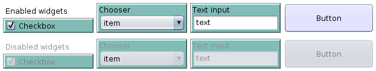

[Color](#color), [Commands](#commands), [Enabled?](#enabled?), [Font-color](#font-color), [Font-size](#font-size), [Height](#height), [Hidden?](#hidden?), [Increment](#increment), [Items](#items), [Key](#key), [Kind](#kind), [Label](#label), [Maximum](#maximum), [Minimum](#minimum), [Opaque?](#opaque?), [Order](#order), [Selected-item](#selected-item), [Selected-items](#selected-items), [Selected?](#selected?), [Tab](#tab), [Text](#text), [Title](#title), [Units](#units), [Value](#value), [Width](#width), [X](#x), [Y](#y)

---
## Color

The background color of the widget.

For widgets with the [Opaque?](#opaque) property, `xw:opaque?` need to be `true` for the background color to be apparent.

[Getter](Primitives.md#xwproperty) | [Setter](Primitives.md#xwset-property) | Type | Applies To
--- | --- | --- | ---
`xw:color` | `xw:set-color` | [Color](Colors) | [Tab](Kinds.md#tab), [Button](Kinds.md#button), [Checkbox](Kinds.md#checkbox), [Chooser](Kinds.md#chooser), [Multi-Chooser](Kinds.md#multi-chooser), [Note](Kinds.md#note), [Numeric Input](Kinds.md#numeric-input), [Slider](Kinds.md#slider), [Text-Input](Kinds.md#text-input).

---
## Commands

The commands to be run when a [button](Kinds.md#button) is clicked.

Those commands are provided as a string that is not pre-compiled: if there are errors in the command, you will only find out at runtime. (This is similar to using [`run`](http://ccl.northwestern.edu/netlogo/docs/dictionary.html#run) with a string).

[Getter](Primitives.md#xwproperty) | [Setter](Primitives.md#xwset-property) | Type | Applies To
--- | --- | --- | ---
`xw:commands` | `xw:set-commands` | String | [Button](Kinds.md#button).

---
## Enabled?

A widget that is enabled allows user to change the value(s) entered in the widget. A widget that is disabled... doesn't. A disabled widget still appears on the screen, but it is grayed out and cannot be changed until it is enabled again.



For a [Note](Kinds.md#note), with which no user interaction is possible anyway, disabling it only makes it appear grayed out.

Note that calling `xw:set-enabled? false` on a [Tab](Kinds.md#tab) will make all the widgets on that tab appear disabled _without_ affecting their [Enabled?](#enabled) property. This way, if you later re-enable the tab, you will get the same mixture of enabled/disabled widgets that you had before disabling the tab. If you _do_ want to individually disable all the widgets on a tab, you can do:

    xw:ask xw:widgets xw:with [ xw:tab = "my-tab" ] [
      xw:set-enabled? false
    ]

[Getter](Primitives.md#xwproperty) | [Setter](Primitives.md#xwset-property) | Type | Applies To
--- | --- | --- | ---
`xw:enabled?` | `xw:set-enabled?` | Boolean | [Tab](Kinds.md#tab), [Button](Kinds.md#button), [Checkbox](Kinds.md#checkbox), [Chooser](Kinds.md#chooser), [Multi-Chooser](Kinds.md#multi-chooser), [Note](Kinds.md#note), [Numeric Input](Kinds.md#numeric-input), [Slider](Kinds.md#slider), [Text-Input](Kinds.md#text-input).

---
## Font-color

The color of the font for text displayed on the widgets.

[Getter](Primitives.md#xwproperty) | [Setter](Primitives.md#xwset-property) | Type | Applies To
--- | --- | --- | ---
`xw:font-color` | `xw:set-font-color` | [Color](Colors) | [Button](Kinds.md#button), [Checkbox](Kinds.md#checkbox), [Chooser](Kinds.md#chooser), [Multi-Chooser](Kinds.md#multi-chooser), [Note](Kinds.md#note), [Numeric Input](Kinds.md#numeric-input), [Slider](Kinds.md#slider), [Text-Input](Kinds.md#text-input).

---
## Font-size

The size of the font for text displayed on the widgets.

The font size cannot be smaller than 1.

[Getter](Primitives.md#xwproperty) | [Setter](Primitives.md#xwset-property) | Type | Applies To
--- | --- | --- | ---
`xw:font-size` | `xw:set-font-size` | Number | [Button](Kinds.md#button), [Checkbox](Kinds.md#checkbox), [Chooser](Kinds.md#chooser), [Multi-Chooser](Kinds.md#multi-chooser), [Note](Kinds.md#note), [Numeric Input](Kinds.md#numeric-input), [Slider](Kinds.md#slider), [Text-Input](Kinds.md#text-input).

---
## Height

The height of a widget, in pixels.

A common use of this property is `[ xw:height + xw:y ] xw:of "widget"`, which gives you the bottom coordinate of a widget, which you can use to position another widget under it.

Setting the width to a negative number is currently allowed by the extension, but it will make your widget disappear.

[Getter](Primitives.md#xwproperty) | [Setter](Primitives.md#xwset-property) | Type | Applies To
--- | --- | --- | ---
`xw:height` | `xw:set-height` | Number | [Button](Kinds.md#button), [Checkbox](Kinds.md#checkbox), [Chooser](Kinds.md#chooser), [Multi-Chooser](Kinds.md#multi-chooser), [Note](Kinds.md#note), [Numeric Input](Kinds.md#numeric-input), [Slider](Kinds.md#slider), [Text-Input](Kinds.md#text-input).

---
## Hidden?

Whether a widget is hidden or not.

A hidden widget is not visible to the user, but its properties can still be manipulated through code.

[Getter](Primitives.md#xwproperty) | [Setter](Primitives.md#xwset-property) | Type | Applies To
--- | --- | --- | ---
`xw:hidden?` | `xw:set-hidden?` | Boolean | [Button](Kinds.md#button), [Checkbox](Kinds.md#checkbox), [Chooser](Kinds.md#chooser), [Multi-Chooser](Kinds.md#multi-chooser), [Note](Kinds.md#note), [Numeric Input](Kinds.md#numeric-input), [Slider](Kinds.md#slider), [Text-Input](Kinds.md#text-input).

---
## Increment

The number by which the value of a [Slider](Kinds.md#slider) is changed when a user moves it.

[Getter](Primitives.md#xwproperty) | [Setter](Primitives.md#xwset-property) | Type | Applies To
--- | --- | --- | ---
`xw:increment` | `xw:set-increment` | Number | [Slider](Kinds.md#slider).

---
## Items

The list of items available to select in a [Chooser](Kinds.md#chooser) or [Multi-Chooser](Kinds.md#multi-chooser).

[Getter](Primitives.md#xwproperty) | [Setter](Primitives.md#xwset-property) | Type | Applies To
--- | --- | --- | ---
`xw:items` | `xw:set-items` | List | [Chooser](Kinds.md#chooser), [Multi-Chooser](Kinds.md#multi-chooser).

---
## Key

The string by which a widget or tab is uniquely identified.

You need to provide a key when you create a widget through [<tt>xw:create-<i>&lt;kind&gt;</i></tt>](#xwcreate-kind), but also when you want to manipulate one (or many) widgets with  [`xw:ask`](Primitives.md#xwask), [`xw:get`](Primitives.md#xwget), [`xw:of`](Primitives.md#xwof), [`xw:remove`](Primitives.md#xwremove), [`xw:set`](Primitives.md#xwset) and [`xw:with`](Primitives.md#xwwith). The [`xw:widgets`](Primitives.md#xwwidgets) and [<tt>xw:<i>&lt;kinds&gt;</i></tt>](Primitives.md#xwkinds) primitives report list of keys.

This property is read-only.

[Getter](Primitives.md#xwproperty) | [Setter](Primitives.md#xwset-property) | Type | Applies To
--- | --- | --- | ---
`xw:key` | None | String | [Tab](Kinds.md#tab), [Button](Kinds.md#button), [Checkbox](Kinds.md#checkbox), [Chooser](Kinds.md#chooser), [Multi-Chooser](Kinds.md#multi-chooser), [Note](Kinds.md#note), [Numeric Input](Kinds.md#numeric-input), [Slider](Kinds.md#slider), [Text-Input](Kinds.md#text-input).

---
## Kind

A string description of the kind of a widget or tab.

A common use case is excluding some kinds of widgets from an operation. For example:

```nlogo
foreach xw:widgets xw:with [ not member? xw:kind ["NOTE" "BUTTON"] ] [
  print xw:get ?
]
```

This property is read-only.

[Getter](Primitives.md#xwproperty) | [Setter](Primitives.md#xwset-property) | Type | Applies To
--- | --- | --- | ---
`xw:kind` | None | String | [Tab](Kinds.md#tab), [Button](Kinds.md#button), [Checkbox](Kinds.md#checkbox), [Chooser](Kinds.md#chooser), [Multi-Chooser](Kinds.md#multi-chooser), [Note](Kinds.md#note), [Numeric Input](Kinds.md#numeric-input), [Slider](Kinds.md#slider), [Text-Input](Kinds.md#text-input).

---
## Label

A string that serves as a label for the widget.

[Getter](Primitives.md#xwproperty) | [Setter](Primitives.md#xwset-property) | Type | Applies To
--- | --- | --- | ---
`xw:label` | `xw:set-label` | String | [Button](Kinds.md#button), [Checkbox](Kinds.md#checkbox), [Chooser](Kinds.md#chooser), [Multi-Chooser](Kinds.md#multi-chooser), [Numeric Input](Kinds.md#numeric-input), [Slider](Kinds.md#slider), [Text-Input](Kinds.md#text-input).

---
## Maximum

The maximum number that a user can select in a slider.

[Getter](Primitives.md#xwproperty) | [Setter](Primitives.md#xwset-property) | Type | Applies To
--- | --- | --- | ---
`xw:maximum` | `xw:set-maximum` | Number | [Slider](Kinds.md#slider).

---
## Minimum

The minimum number that a user can select in a slider.

[Getter](Primitives.md#xwproperty) | [Setter](Primitives.md#xwset-property) | Type | Applies To
--- | --- | --- | ---
`xw:minimum` | `xw:set-minimum` | Number | [Slider](Kinds.md#slider).

---
## Opaque?

Whether or not a widget has a colored background and a border.

(Note that the background of an "opaque" widget can still be made transparent by setting it to a [transparent color](Colors), e.g.: `xw:set-color [0 0 0 0]`.)

[Getter](Primitives.md#xwproperty) | [Setter](Primitives.md#xwset-property) | Type | Applies To
--- | --- | --- | ---
`xw:opaque?` | `xw:set-opaque?` | Boolean | [Checkbox](Kinds.md#checkbox), [Chooser](Kinds.md#chooser), [Multi-Chooser](Kinds.md#multi-chooser), [Note](Kinds.md#note), [Numeric Input](Kinds.md#numeric-input), [Slider](Kinds.md#slider), [Text-Input](Kinds.md#text-input).

---
## Order

The order in which an extra tab appears relative to other extra tabs.

This property that can be set to any valid NetLogo number. Tabs will lower `xw:order` will appear before (i.e., to the left of) tabs with higher numbers. If two tabs have the same `xw:order` (as will usually be the case since all tabs have order `0` by default), they appear in order of creation­.

[Getter](Primitives.md#xwproperty) | [Setter](Primitives.md#xwset-property) | Type | Applies To
--- | --- | --- | ---
`xw:order` | `xw:set-order` | Number | [Tab](Kinds.md#tab).

---
## Selected-item

The item that is currently selected in a chooser. If no item is selected (i.e., if the list of available items is empty), it contains `nobody`.

[Getter](Primitives.md#xwproperty) | [Setter](Primitives.md#xwset-property) | Type | Applies To
--- | --- | --- | ---
`xw:selected-item` | `xw:set-selected-item` | Any | [Chooser](Kinds.md#chooser).

---
## Selected-items

The list of items that are currently selected in a multi-chooser. It contains an empty list of no items are currently selected.

[Getter](Primitives.md#xwproperty) | [Setter](Primitives.md#xwset-property) | Type | Applies To
--- | --- | --- | ---
`xw:selected-items` | `xw:set-selected-items` | List | [Multi-Chooser](Kinds.md#multi-chooser).

---
## Selected?

Whether or not a checkbox is currently selected.

[Getter](Primitives.md#xwproperty) | [Setter](Primitives.md#xwset-property) | Type | Applies To
--- | --- | --- | ---
`xw:selected?` | `xw:set-selected?` | Boolean | [Checkbox](Kinds.md#checkbox).

---
## Tab

The key of the tab on which the widget currently is.

By setting the value of this property, you can move a widget from one tab to another.

If you want to create a widget on a tab other than the last tab added, it is necessary to manually set the tab using `xw:set-tab`.

[Getter](Primitives.md#xwproperty) | [Setter](Primitives.md#xwset-property) | Type | Applies To
--- | --- | --- | ---
`xw:tab` | `xw:set-tab` | String | [Button](Kinds.md#button), [Checkbox](Kinds.md#checkbox), [Chooser](Kinds.md#chooser), [Multi-Chooser](Kinds.md#multi-chooser), [Note](Kinds.md#note), [Numeric Input](Kinds.md#numeric-input), [Slider](Kinds.md#slider), [Text-Input](Kinds.md#text-input).

---
## Text

The text of a note or text input widget.

In the case of a text input widget, the text can be modified by the user.

[Getter](Primitives.md#xwproperty) | [Setter](Primitives.md#xwset-property) | Type | Applies To
--- | --- | --- | ---
`xw:text` | `xw:set-text` | String | [Note](Kinds.md#note), [Text-Input](Kinds.md#text-input).

---
## Title

The title of a tab.

[Getter](Primitives.md#xwproperty) | [Setter](Primitives.md#xwset-property) | Type | Applies To
--- | --- | --- | ---
`xw:title` | `xw:set-title` | String | [Tab](Kinds.md#tab).

---
## Units

The string that appears after the value on a slider widget.

It is often used for things like `"%"`, `"$"`, `"km"`, etc., but it can be any string, as long as you want (though a long string may not fit in your slider).

[Getter](Primitives.md#xwproperty) | [Setter](Primitives.md#xwset-property) | Type | Applies To
--- | --- | --- | ---
`xw:units` | `xw:set-units` | Number | [Slider](Kinds.md#slider).

---
## Value

The current numeric value of a slider or numeric input box.

In both cases, the value can be modified by the user interacting with the widget.

[Getter](Primitives.md#xwproperty) | [Setter](Primitives.md#xwset-property) | Type | Applies To
--- | --- | --- | ---
`xw:value` | `xw:set-value` | Number | [Numeric Input](Kinds.md#numeric-input), [Slider](Kinds.md#slider).

---
## Width

The width of a widget, in pixels.

A common use of this property is `[ xw:width + xw:y ] xw:of "widget"`, which gives you the right coordinate of a widget, which you can use to position another widget beside it.

Setting the width to a negative number is currently allowed by the extension, but it will make your widget disappear.

[Getter](Primitives.md#xwproperty) | [Setter](Primitives.md#xwset-property) | Type | Applies To
--- | --- | --- | ---
`xw:width` | `xw:set-width` | Number | [Button](Kinds.md#button), [Checkbox](Kinds.md#checkbox), [Chooser](Kinds.md#chooser), [Multi-Chooser](Kinds.md#multi-chooser), [Note](Kinds.md#note), [Numeric Input](Kinds.md#numeric-input), [Slider](Kinds.md#slider), [Text-Input](Kinds.md#text-input).

---
## X

The _x_ (i.e., horizontal) coordinate of the widget on the screen.

Coordinate (0, 0) is the top left corner of the screen.

You can set the _x_ coordinate of a widget to a negative number, but it will make your widget disappear, partially or completely.

[Getter](Primitives.md#xwproperty) | [Setter](Primitives.md#xwset-property) | Type | Applies To
--- | --- | --- | ---
`xw:x` | `xw:set-x` | Number | [Button](Kinds.md#button), [Checkbox](Kinds.md#checkbox), [Chooser](Kinds.md#chooser), [Multi-Chooser](Kinds.md#multi-chooser), [Note](Kinds.md#note), [Numeric Input](Kinds.md#numeric-input), [Slider](Kinds.md#slider), [Text-Input](Kinds.md#text-input).

---
## Y

The _y_ (i.e., vertical) coordinate of the widget on the screen.

Coordinate (0, 0) is the top left corner of the screen.

You can set the _y_ coordinate of a widget to a negative number, but it will make your widget disappear, partially or completely.

[Getter](Primitives.md#xwproperty) | [Setter](Primitives.md#xwset-property) | Type | Applies To
--- | --- | --- | ---
`xw:y` | `xw:set-y` | Number | [Button](Kinds.md#button), [Checkbox](Kinds.md#checkbox), [Chooser](Kinds.md#chooser), [Multi-Chooser](Kinds.md#multi-chooser), [Note](Kinds.md#note), [Numeric Input](Kinds.md#numeric-input), [Slider](Kinds.md#slider), [Text-Input](Kinds.md#text-input).
