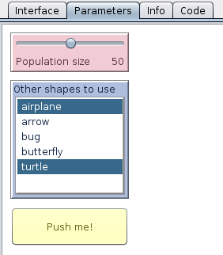

# Getting Started

After [installing the extension](https://github.com/CRESS-Surrey/eXtraWidgets#installing) the best way to learn how to use it is probably to follow a sequence like this:

- First try [the simple example below](#getting-your-feet-wet);
- Then, the one important concept to understand is [how widget contexts work](Widget-contexts.md);
- After that, learning [how to create a dynamic interface](Creating-dynamic-interfaces.md) will help you take things a step further;
- Once you've done all that, it's mostly a matter of getting to know all the [primitives](Primitives.md), [widget kinds](Kinds.md) and [properties](Properties.md).
- Finally, if you are planning to perform experiments on your model, you should read the section on [how to use the extension with BehaviorSpace](Using-the-extension-with-BehaviorSpace.md).

# Getting Help

If you encounter any difficulties, [ask a question on StackOverflow](http://stackoverflow.com/questions/tagged/netlogo). If you believe you have found a bug (or would like to request a feature) [open a new issue](https://github.com/CRESS-Surrey/eXtraWidgets/issues/new).

Please note that the extension is not meant to completely replace NetLogo's regular interface tab: output widgets like monitors and plots and, more importantly, the view, are not available in extra tabs and probably won't be any time soon.

# Getting your feet wet

What follows is an example demonstrating some of the things that you can do with the extension. (Note that a [good place to put your interface code](Creating your interface at startup.md) is in the  [`startup`](http://ccl.northwestern.edu/netlogo/docs/dictionary.html#startup) procedure, which runs automatically when your model is opened.)

```
extensions [xw]

to startup
  xw:clear-all ; remove all previous extra tabs and widgets, if any
  ; create a new tab to the right of the regular interface tab
  ; (tabs and widgets need a "key": a string that identifies them)
  xw:create-tab "t1" [ ; we use "t1" as the key for our new tab
    ; and set its properties within a command block:
    xw:set-title "Parameters"
  ]
  ; create a slider on the new tab, similar to a regular slider
  ; the slider is placed in the upper left corner by default
  xw:create-slider "population" [
    xw:set-label "Population size"
  ]
  ; a "multi-chooser", unlike a regular chooser,
  ; lets you select multiple items:
  xw:create-multi-chooser "shapes" [
    xw:set-label "Other shapes to use"
    xw:set-items ["airplane" "arrow" "bug" "butterfly" "turtle"]
    xw:set-selected-items n-of 2 xw:items ; two random shapes by default
    ; set y relative to the bottom of the "population" slider:
    xw:set-y [ xw:y + xw:height + 10 ] xw:of "population"
    xw:set-height 150
  ]
  ; you can also put buttons on the extra tabs:
  xw:create-button "setup" [
    xw:set-label "Push me!"
    ; commands, given as strings, are compiled on execution:
    xw:set-commands "setup"
    xw:set-y [ xw:y + xw:height + 10 ] xw:of "shapes"
  ]
  ; xw:ask let's you do stuff with multiple widgets at a time
  ; (see also xw:of and xw:with)
  xw:ask xw:widgets [
    xw:set-color one-of base-colors + 3 ; widgets can be any color!
    ; and you can change their text color as well:
    xw:set-font-color xw:color - 6
  ]
  xw:select-tab 2 ; show our newly created tab
end
```

Here is a possible outcome of this procedure on Linux (it would look slightly different on Mac or Windows):



Now let's use the values from those widgets in your `setup` procedure. As opposed to regular NetLogo widgets, extra widgets don't create global variables. You need to use `xw:get` and `xw:set` to get and set their values. Here is how you could do it in this case:

```
to setup
  clear-all
  create-turtles xw:get "population" [
    set shape one-of fput "default" xw:get "shapes"
    fd 10
    xw:select-tab 1 ; select the regular interface tab
  ]
end
```
